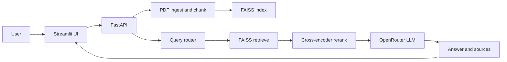

# Government Scheme Navigator

Upload one government scheme PDF, ask eligibility or application questions, and get answers grounded in that document with cited source chunks (page numbers + chunk text).

## Prerequisites

| Requirement | Notes |
|-------------|-------|
| Python 3.12 | `python3 --version` |
| OpenRouter API key | Free signup at [openrouter.ai](https://openrouter.ai). Used for answer generation. |
| ~2 GB free disk | First run downloads embedding (~90 MB) and reranker (~100 MB) models. |
| Internet | Required on first upload (model download) and for each question (LLM call). |

No sample PDF is bundled. Use any text-based public scheme PDF (scanned image-only PDFs may not extract well).

## Quick start (local)

Clone the repo, then run backend and frontend in **two terminals**.

### 1. Backend

```bash
git clone https://github.com/FarhanS311/agentic_ai_phase_1.git
cd agentic_ai_phase_1

python3 -m venv backend/venv
backend/venv/bin/pip install -r backend/requirements.txt

cd backend
cp .env.example .env
```

Edit `backend/.env` and set your key:

```env
OPENROUTER_API_KEY=sk-or-v1-your-key-here
```

Start the API:

```bash
source venv/bin/activate
uvicorn app.main:app --reload --host 127.0.0.1 --port 8000
```

Leave this terminal running. API docs: [http://127.0.0.1:8000/docs](http://127.0.0.1:8000/docs)

### 2. Frontend

Open a **second terminal**:

```bash
cd agentic_ai_phase_1/frontend
python3 -m venv venv
venv/bin/pip install -r requirements.txt
source venv/bin/activate
streamlit run app.py
```

Browser opens at [http://localhost:8501](http://localhost:8501).

Optional: point Streamlit at a different backend with `BACKEND_URL=http://127.0.0.1:8000` (default).

### 3. Demo the app

1. Upload a scheme PDF in the browser (first upload may take 1–3 minutes while models download).
2. Wait for the success message showing chunk count.
3. Ask a question, e.g. *Who is eligible for this scheme?* or *How do I apply?*
4. Read the answer, then expand **Sources** to see page numbers and cited chunk text.

If the answer is not in the document, the model responds with: `The answer is not in this document.`

## Reviewer checklist

- [ ] Backend running on port 8000 (`GET http://127.0.0.1:8000/api/status` returns JSON)
- [ ] Streamlit UI open on port 8501
- [ ] PDF uploads without error
- [ ] Question returns a grounded answer
- [ ] **Sources** panel shows page number, chunk id, and chunk text

## Architecture

Single-document RAG pipeline: one PDF at a time. A new upload replaces the previous index.



**Flow summary**

1. **Upload** — PDF is chunked (2500 chars, 300 overlap), embedded, and stored in a local FAISS index.
2. **Ask** — Question is routed (single / multi-part / summary), relevant chunks are retrieved and reranked, then an LLM generates an answer using only retrieved context.
3. **Sources** — Citations come from retrieved chunks (not LLM-generated); each source includes page number and chunk text.

## Tech stack

| Layer | Technology |
|-------|------------|
| Frontend | Streamlit, httpx |
| API | FastAPI, Uvicorn |
| Orchestration | LangChain LCEL |
| PDF parsing | PyPDF (LangChain loader) |
| Embeddings | `sentence-transformers/all-MiniLM-L6-v2` |
| Vector store | FAISS (`IndexFlatIP`, local disk) |
| Reranking | `cross-encoder/ms-marco-MiniLM-L-6-v2` |
| LLM | OpenRouter (`openai/gpt-4o-mini` default) |
| Config | python-dotenv (`.env`) |
| Tests | pytest |

## Project layout

```
agentic_ai_phase_1/
├── backend/
│   ├── app/           # RAG pipeline + FastAPI routes
│   ├── scripts/       # CLI tools for development (optional)
│   ├── data/index/    # FAISS index (created on upload, gitignored)
│   └── .env           # secrets (copy from .env.example)
└── frontend/
    └── app.py         # Streamlit UI
```

## Configuration

Copy `backend/.env.example` to `backend/.env`:

| Variable | Required | Default | Description |
|----------|----------|---------|-------------|
| `OPENROUTER_API_KEY` | Yes | — | API key from OpenRouter |
| `OPENROUTER_BASE_URL` | No | `https://openrouter.ai/api/v1` | OpenAI-compatible base URL |
| `OPENROUTER_MODEL` | No | `openai/gpt-4o-mini` | Model used for routing and answers |
| `BACKEND_URL` | No | `http://127.0.0.1:8000` | Frontend only; API base URL |

## API reference

Base URL: `http://127.0.0.1:8000`

Interactive docs: `/docs` (Swagger) and `/redoc`

### `GET /api/status`

Returns whether a document is indexed.

**Response 200**

```json
{
  "ready": true,
  "filename": "scheme.pdf",
  "chunk_count": 12
}
```

When no document is loaded: `"ready": false`, `"filename": null`, `"chunk_count": null`.

---

### `POST /api/upload`

Upload and index a PDF. Replaces any previously indexed document.

**Request** — `multipart/form-data`

| Field | Type | Description |
|-------|------|-------------|
| `file` | file | PDF file |

**Response 200**

```json
{
  "filename": "scheme.pdf",
  "chunk_count": 12,
  "message": "Indexed 12 chunk(s) from scheme.pdf"
}
```

**Errors**

| Status | Cause |
|--------|-------|
| 400 | Not a PDF or empty file |
| 422 | PDF has no extractable text |

**Example (curl)**

```bash
curl -X POST http://127.0.0.1:8000/api/upload \
  -F "file=@/path/to/scheme.pdf"
```

---

### `POST /api/ask`

Ask a question against the indexed document.

**Request** — `application/json`

```json
{
  "question": "Who is eligible for this scheme?",
  "k": 4
}
```

| Field | Type | Required | Default | Description |
|-------|------|----------|---------|-------------|
| `question` | string | Yes | — | User question (min 1 char) |
| `k` | integer | No | 4 | Number of chunks sent to LLM (1–20) |

**Response 200**

```json
{
  "answer": "Eligible applicants must be resident farmers with valid land records.",
  "query_type": "single_fact",
  "sub_queries": ["Who is eligible for this scheme?"],
  "sources": [
    {
      "id": 0,
      "page": 1,
      "snippet": "Eligibility: applicant must be a resident farmer...",
      "text": "Eligibility: applicant must be a resident farmer with landholding records."
    }
  ]
}
```

| Field | Description |
|-------|-------------|
| `query_type` | `single_fact`, `multi_part`, or `summarization` |
| `sub_queries` | Sub-questions used for retrieval |
| `sources[].id` | Chunk index in the document |
| `sources[].page` | 1-based PDF page number |
| `sources[].snippet` | First 200 characters of chunk |
| `sources[].text` | Full chunk text for UI display |

**Errors**

| Status | Cause |
|--------|-------|
| 409 | No document indexed; upload a PDF first |
| 422 | Invalid request body |

**Example (curl)**

```bash
curl -X POST http://127.0.0.1:8000/api/ask \
  -H "Content-Type: application/json" \
  -d '{"question": "How do I apply?", "k": 4}'
```

## Tests

```bash
cd backend
source venv/bin/activate
pytest
```

Tests use mocked LLMs where possible; no live OpenRouter calls required for the default suite.

## Troubleshooting

| Problem | Fix |
|---------|-----|
| `Cannot reach backend` in Streamlit | Start uvicorn first (`cd backend && uvicorn app.main:app --reload --host 127.0.0.1 --port 8000`) |
| `OPENROUTER_API_KEY is not set` | Create `backend/.env` from `.env.example` and set the key |
| Upload hangs on first run | Normal — embedding and reranker models are downloading |
| Empty or wrong chunks | Use a text-based PDF, not a scanned image |
| `409` on `/api/ask` | Upload a PDF before asking a question |

## Development CLI (optional)

The `backend/scripts/` folder has CLI tools for pipeline debugging (`ingest_pdf`, `build_index`, `query_index`, `ask_rag`). The Streamlit UI is the primary demo path; you do not need these scripts to run the app.
